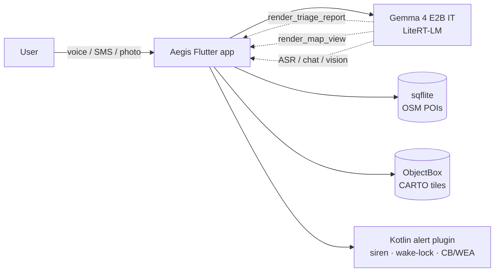

# Aegis

> **Offline-first AI emergency assistant.** One on-device Gemma 4 model powers voice triage, structured incident reports, alert classification, and nearby-places lookup. No cloud, no telemetry — every capability survives a dead network.

When a cyclone takes the cell towers down, your emergency app cannot phone home. Aegis is the assistant that still answers when the bars are gone: it transcribes survivor statements, grades damage photos against the FEMA HAZUS scale, files ICS-209 / OCHA SITREP reports, classifies inbound WEA / Cell-Broadcast alerts, and shows nearby shelters / hospitals / water points on an offline basemap — all on a mid-range Android phone in airplane mode.

```
┌──────────────────────────────────────────────────────────┐
│  📱  Aegis  ·  Gemma 4 E2B IT  ·  Piper TTS  ·  OSM POI  │
│      No network after onboarding · One model · Many roles│
└──────────────────────────────────────────────────────────┘
```

---

## Highlights

- 🧠 **One model, many capabilities.** Gemma 4 handles chat, ASR, vision (damage photos), and native function calling — no per-task specialist models.
- 🛠 **Agentic tool calling.** `render_triage_report` produces structured incident cards; `render_map_view` produces inline nearby-places maps. Tools are declared as JSON Schema and surfaced through LiteRT-LM's native `<tool_call>` parser.
- 📜 **Skills as markdown.** Partner orgs (WHO, IFRC, ICRC) can ship new capabilities by dropping a `SKILL.md` file — no Dart recompile.
- 📡 **Alert pipeline.** Cell-broadcast / WEA / SMS → Kotlin receiver → Gemma 4 classifier → siren + full-screen takeover + spoken briefing in the user's language.
- 🗺 **Offline map.** OSM Overpass POIs in sqflite, CARTO Voyager raster tiles in ObjectBox (FMTC), 25 km radius pre-seeded at onboarding.
- 🌐 **Multilingual.** EN + HI today, scaffolded for HI / BN / GU / PA / TA / TE / KN / ML / MR / UR / AR / ES / PT / FR / DE / IT / RU / TR / ZH / JA / KO / ID / VI / TH via the model catalog and Piper voices.
- 📵 **Survives airplane mode.** Only network calls are the one-time onboarding seeds.

---

## Architecture at a glance



Deeper dive: see [**docs/ARCHITECTURE.md**](docs/ARCHITECTURE.md) for sequence diagrams of the chat-turn loop, alert pipeline, cold-start emergency, and the full repo layout.

---

## Quickstart

### Prerequisites

| Tool | Version |
|---|---|
| Flutter SDK | `^3.41.7` (pin via FVM) |
| Dart | `^3.11.5` |
| Android SDK | `compileSdk 34`, `minSdk 24+` |
| Device | Android 8+ with ~4 GB free for model packs |

The project ships with `fvm` config — the system Flutter on most machines is too old. Use `fvm flutter …` everywhere.

### Run

```bash
fvm flutter pub get
fvm dart run build_runner build --delete-conflicting-outputs
fvm flutter run -d <device-id>
```

First launch downloads the model packs (Gemma 4 IT `.litertlm`, Piper voices, Silero VAD) plus seeds the offline place database + map tiles for the region you pick. Budget ~5 minutes on a fast connection. After that everything works offline.

### Release build

```bash
fvm flutter build apk --release \
  --obfuscate \
  --split-debug-info=./debug-info/
```

ProGuard rules cover the LiteRT-LM JNI and ObjectBox generated classes; obfuscation is safe.

---

## Project structure (high level)

```
lib/
├── app/                          # MaterialApp · GoRouter · theme
├── core/
│   ├── alert/                    # Telephony alert pipeline (Dart)
│   ├── llm/function_router.dart  # Gemma 4-driven SMS classifier
│   ├── places/                   # OSM POI + tile cache for find-nearby-places
│   ├── skills/                   # SkillsRegistry (markdown → system prompt)
│   ├── storage/                  # Hive wrapper (settings · contacts · reports)
│   └── voice/                    # LLM · STT · TTS · audio capture
├── features/
│   ├── home/                     # Chat + intake + assistant cubit
│   ├── onboarding/               # 7-step funnel
│   ├── places/                   # Inline map card + standalone page
│   ├── reports/                  # Triage archive
│   └── splash/
├── models/
└── l10n/                         # arb files (EN, HI)

assets/skills/                    # Agent Skills catalog (markdown)
android/app/src/main/kotlin/
└── com/resq/aegis/alert/         # SMS receiver · foreground siren · full-screen activity

docs/ARCHITECTURE.md              # The single source of truth
```

---

## Gemma 4 capabilities used

| Capability | Aegis surface | Wired in |
|---|---|---|
| Multilingual chat | Home conversation | `LlmService.askStream` |
| Vision (image input) | Triage damage photo | `Message(imageBytes: …)` in `generateReport` |
| Audio (ASR) | Mic transcription | `SttService.transcribeStream` |
| Native function calling | Triage + map tools | `Tool(name, description, parameters)` + `<tool_call>` parser |
| Tool-choice modes | `required` for triage, `auto` for chat | `model.createChat(toolChoice: …)` |

Two `Tool` objects are declared today; adding a new one is roughly **schema → handler → done**:

```dart
final Tool _renderMapViewTool = const Tool(
  name: 'render_map_view',
  description: 'Render an inline map showing nearby disaster-critical '
      'places (shelter, hospital, water, pharmacy, fuel, etc.) …',
  parameters: _mapViewToolSchema, // JSON Schema
);
```

Skills live in `assets/skills/<id>/SKILL.md`; their frontmatter is concatenated into Gemma 4's system prompt at chat creation so the model can pick a skill by id without any Dart-side dispatch table.

---

## Offline footprint after onboarding

| Asset | Size | Notes |
|---|---|---|
| Gemma 4 E2B IT (`.litertlm`) | ~3.4 GB | One model serves chat + ASR + vision + tools |
| Piper TTS voices | ~10-50 MB each | One per language |
| Silero VAD | ~2 MB | |
| sqflite places.db | ~1-3 MB | ~3 k POIs per 25 km bbox |
| FMTC tile store | ~30 MB | CARTO Voyager, zoom 11-16 |

Total per region: roughly **3.5 GB** including model.

---

## Status

| Feature | State |
|---|---|
| Offline chat with Gemma 4 (EN + HI) | ✅ |
| Triage reports (ICS-209 / OCHA SITREP) | ✅ |
| Damage grading with HAZUS scale | ✅ |
| Find-nearby-places skill with inline map | ✅ |
| Offline raster basemap (CARTO via FMTC) | ✅ |
| Alert pipeline (CB / WEA / SMS → Gemma classifier → siren) | ✅ |
| Resumable parallel model-pack download | ✅ |
| Emergency-contact SMS fan-out | ✅ |
| Plan-evacuation-route skill | 🚧 |
| BLE mesh beacon match | 🚧 |
| iOS port | ⏳ |

---

## Documentation map

| File | Purpose |
|---|---|
| [`docs/ARCHITECTURE.md`](docs/ARCHITECTURE.md) | Full technical architecture with mermaid diagrams |
| [`assets/skills/*/SKILL.md`](assets/skills) | Per-skill capability declarations |
| `android/app/src/main/AndroidManifest.xml` | Permissions + native receivers + full-screen-intent activity |
| `lib/core/voice/llm_service.dart` | Gemma 4 wrapper — read this first when changing tools or prompts |

---

## Contributing

Aegis is built for disaster-response orgs who need an offline assistant they can audit end-to-end.

- Open an issue describing the disaster scenario you are trying to support.
- New skills are PRs that add `assets/skills/<id>/SKILL.md` + an entry in `SkillsRegistry._builtInSkillIds`.
- New languages are PRs that add a Piper TTS pack to `ModelCatalog` + arb files under `lib/l10n/`.
- Run `fvm dart analyze` clean before opening a PR.

Conventional commits format. Native Android changes need a build verified against `minSdk 24`.

---

## Acknowledgements

- **Gemma 4** — Google DeepMind, used under the Gemma Terms of Use
- **LiteRT-LM** — Google AI Edge
- **flutter_gemma** — Pavel Kosenko (`flutter_gemma`)
- **sherpa_onnx** + **Piper** — neural TTS
- **OpenStreetMap** contributors — POI data via Overpass API
- **CARTO** — Voyager raster basemap
- **flutter_map_tile_caching** — JaffaKetchup
- **ICS-209 / OCHA SITREP / FEMA HAZUS** — public-sector incident-report templates

---

## License

See [`LICENSE`](LICENSE) at the repo root.

Map tiles © OpenStreetMap contributors, © CARTO. POI data © OpenStreetMap contributors via Overpass.
