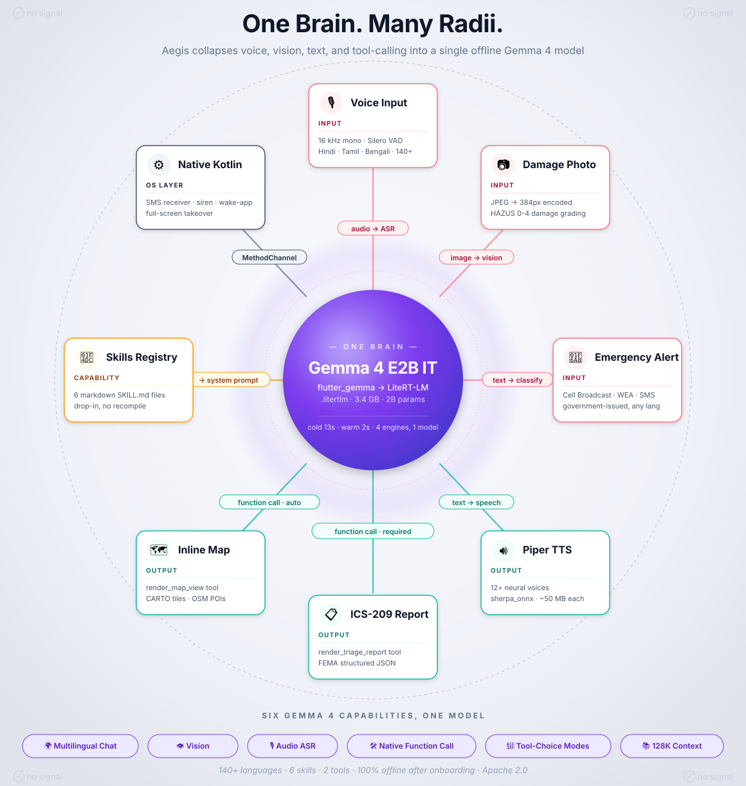

# Aegis

> **Offline-first AI emergency assistant.** One on-device Gemma 4 model powers voice triage, structured incident reports, alert classification, and nearby-places lookup. No cloud, no telemetry — every capability survives a dead network.

When a cyclone takes the cell towers down, your emergency app cannot phone home. Aegis is the assistant that still answers when the bars are gone: it transcribes survivor statements, grades damage photos against the FEMA HAZUS scale, files ICS-209 / OCHA SITREP reports, classifies inbound WEA / Cell-Broadcast alerts, and shows nearby shelters / hospitals / water points on an offline basemap — all on a mid-range Android phone in airplane mode.

<p align="center">
  
  
  
  
  
  
</p>

---

## Highlights

- 🧠 **One model, many capabilities.** Gemma 4 handles chat, ASR, vision (damage photos), and native function calling — no per-task specialist models.
- 🛠 **Agentic tool calling.** `render_triage_report` produces structured incident cards; `render_map_view` produces inline nearby-places maps. Tools are declared as JSON Schema and surfaced through LiteRT-LM's native `<tool_call>` parser.
- 📜 **Skills as markdown.** Partner orgs (WHO, IFRC, ICRC) can ship new capabilities by dropping a `SKILL.md` file — no Dart recompile.
- 📡 **Alert pipeline.** Cell-broadcast / WEA / SMS → Kotlin receiver → Gemma 4 classifier → siren + full-screen takeover + spoken briefing in the user's language.
- 🗺 **Offline map.** OSM Overpass POIs in sqflite, CARTO Voyager raster tiles in ObjectBox (FMTC), 25 km radius pre-seeded at onboarding.
- 🌐 **Multilingual.** EN + HI today, scaffolded for HI / BN / GU / PA / TA / TE / KN / ML / MR / UR / AR / ES / PT / FR / DE / IT / RU / TR / ZH / JA / KO / ID / VI / TH via the model catalog and Piper voices.
- 📵 **Survives airplane mode.** Only network calls are the one-time onboarding seeds.

---

## Architecture at a glance

<p align="center">
  
</p>

Deeper dive: see [**docs/ARCHITECTURE.md**](docs/ARCHITECTURE.md) for sequence diagrams of the chat-turn loop, alert pipeline, cold-start emergency, and the full repo layout.

---

## Quickstart

### Prerequisites

| Tool | Version |
|---|---|
| Flutter SDK | `^3.41.7` (pin via FVM) |
| Dart | `^3.11.5` |
| Android SDK | `compileSdk 34`, `minSdk 24+` |
| Device | Android 8+ with ~4 GB free for model packs |

The project ships with `fvm` config — the system Flutter on most machines is too old. Use `fvm flutter …` everywhere.

### Run

```bash
fvm flutter pub get
fvm dart run build_runner build --delete-conflicting-outputs
fvm flutter run -d <device-id>
```

First launch downloads the model packs (Gemma 4 IT `.litertlm`, Piper voices, Silero VAD) plus seeds the offline place database + map tiles for the region you pick. Budget **10-15 minutes** on a typical mobile connection (faster on Wi-Fi, longer on flaky 4G). After that everything works offline.

### Release build

```bash
fvm flutter build apk --release \
  --obfuscate \
  --split-debug-info=./debug-info/
```

ProGuard rules cover the LiteRT-LM JNI and ObjectBox generated classes; obfuscation is safe.

---

## Project structure (high level)

```
lib/
├── app/                          # MaterialApp · GoRouter · theme
├── core/
│   ├── alert/                    # Telephony alert pipeline (Dart)
│   ├── llm/function_router.dart  # Gemma 4-driven SMS classifier
│   ├── places/                   # OSM POI + tile cache for find-nearby-places
│   ├── skills/                   # SkillsRegistry (markdown → system prompt)
│   ├── storage/                  # Hive wrapper (settings · contacts · reports)
│   └── voice/                    # LLM · STT · TTS · audio capture
├── features/
│   ├── home/                     # Chat + intake + assistant cubit
│   ├── onboarding/               # 7-step funnel
│   ├── places/                   # Inline map card + standalone page
│   ├── reports/                  # Triage archive
│   └── splash/
├── models/
└── l10n/                         # arb files (EN, HI)

assets/skills/                    # Agent Skills catalog (markdown)
android/app/src/main/kotlin/
└── com/resq/aegis/alert/         # SMS receiver · foreground siren · full-screen activity

docs/ARCHITECTURE.md              # The single source of truth
```

---

## Gemma 4 capabilities used

| Capability | Aegis surface | Wired in |
|---|---|---|
| Multilingual chat | Home conversation | `LlmService.askStream` |
| Vision (image input) | Triage damage photo | `Message(imageBytes: …)` in `generateReport` |
| Audio (ASR) | Mic transcription | `SttService.transcribeStream` |
| Native function calling | Triage + map tools | `Tool(name, description, parameters)` + `<tool_call>` parser |
| Tool-choice modes | `required` for triage, `auto` for chat | `model.createChat(toolChoice: …)` |

Two `Tool` objects are declared today; adding a new one is roughly **schema → handler → done**:

```dart
final Tool _renderMapViewTool = const Tool(
  name: 'render_map_view',
  description: 'Render an inline map showing nearby disaster-critical '
      'places (shelter, hospital, water, pharmacy, fuel, etc.) …',
  parameters: _mapViewToolSchema, // JSON Schema
);
```

Skills live in `assets/skills/<id>/SKILL.md`; their frontmatter is concatenated into Gemma 4's system prompt at chat creation so the model can pick a skill by id without any Dart-side dispatch table.

---

## Gemma 4 Integration

Reference for anyone touching the LLM path: where Gemma 4 lives in the tree, which SDK surface it talks to, and how each capability lands in the app.

### 1. SDK pin

`pubspec.yaml` (line 84):

```yaml
flutter_gemma: ^0.15.0  # native ModelType.gemma4 + <tool_call> parser
```

`flutter_gemma 0.15.0` is the first release that exposes `ModelType.gemma4` and wires LiteRT-LM's native function-calling tokens through to Dart. Earlier versions cannot represent Aegis's tool surface.

### 2. Model weights

`lib/core/voice/model_catalog.dart:256`:

```dart
url: 'https://huggingface.co/litert-community/gemma-4-E2B-it-litert-lm/'
     'resolve/7fa1d78473894f7e736a21d920c3aa80f950c0db/'
     'gemma-4-E2B-it.litertlm',
```

The download is content-addressed: SHA-256 is verified after extraction (`ModelPackRepository.install`). The weights are the official Google LiteRT-LM-quantised Gemma 4 E2B Instruction-Tuned model published on Hugging Face by `litert-community`.

### 3. Native `ModelType.gemma4` invocation

`lib/core/voice/llm_service.dart:950` — triage chat session:

```dart
final chat = await model.createChat(
  temperature: 0.3, topK: 40, topP: 0.9,
  supportImage: hasImage,
  supportAudio: input.hasAudio,
  supportsFunctionCalls: true,
  tools: <Tool>[_renderTriageReportTool],
  toolChoice: ToolChoice.required,
  modelType: ModelType.gemma4,      // ← native Gemma 4 chat template
  isThinking: false,
  systemInstruction: systemPrompt,
);
```

The matching ask-mode session lives in `_ensureChat` (around line 1655) and uses `tools: [_renderMapViewTool]` with `ToolChoice.auto`.

### 4. Tool declarations (JSON Schema)

Two `Tool` objects exposed to the model — `lib/core/voice/llm_service.dart:317` and `:375`:

```dart
final Tool _renderTriageReportTool = const Tool(
  name: 'render_triage_report',
  description: 'Render a structured incident report card …',
  parameters: _triageToolSchema,    // ICS-209 / OCHA SITREP / HAZUS schema
);

final Tool _renderMapViewTool = const Tool(
  name: 'render_map_view',
  description: 'Render an inline map showing nearby disaster-critical places …',
  parameters: _mapViewToolSchema,   // categories[], radius_km, spoken_summary
);
```

Schemas are real JSON-Schema dictionaries (`_triageToolSchema`, `_mapViewToolSchema`) with `enum`, `minItems`, `maxLength`, etc. — see lines 165-308 and 320-368.

### 5. Tool-call parsing (`FunctionCallResponse`)

`lib/core/voice/llm_service.dart::_parseToolResponse` consumes the SDK's parsed envelope, not regex:

```dart
final List<FunctionCallResponse> calls = switch (response) {
  FunctionCallResponse() => <FunctionCallResponse>[response],
  ParallelFunctionCallResponse(:final calls) => calls,
  _ => const <FunctionCallResponse>[],
};
```

The streaming chat path (`_askStreamOnce`) does the same: it relays `TextResponse` tokens onto the TTS pipeline and converts `FunctionCallResponse` into a `ChatMapCall` event that the cubit handles.

### 6. Capability → file:line index

| Gemma 4 capability | Aegis code | File:line |
|---|---|---|
| Chat (multilingual, streaming) | `LlmService.askStream` | `lib/core/voice/llm_service.dart:764` |
| Audio (ASR) | `LlmService.transcribeAudio` | `lib/core/voice/llm_service.dart:543` |
| Vision (image input on triage) | `Message(imageBytes: …)` | `lib/core/voice/llm_service.dart` (in `_generateReportOnce`) |
| Native function calling | `Tool` + `FunctionCallResponse` | `lib/core/voice/llm_service.dart:317, 375, _parseToolResponse` |
| Alert classification | `FunctionRouter.route` | `lib/core/llm/function_router.dart` |
| Skill catalog injection | `SkillsRegistry.buildCatalogPrompt` | `lib/core/skills/skills_registry.dart` |

### 7. Runtime evidence

Sample log from a real device run (anonymised):

```
I/flutter: [FfiInferenceModelSession/perf] (async) time-to-first-chunk (prefill): 13262ms
I/flutter: InferenceChat: 1 SDK-parsed tool call(s) at end of stream
I/flutter: [Aegis][LLM] askStream tool=render_map_view argKeys=[categories, radius_km, spoken_summary]
I/flutter: [Aegis][Cubit] ChatMapCall MapViewQuery(categories: hospital, radiusKm: 10.0, spoken: 29c)
I/flutter: [Aegis][Cubit] map call resolved hits=30 radius=10.0km
```

The `[FfiInferenceModelSession/perf]` line is emitted by LiteRT-LM's FFI bridge; `[Aegis][LLM]` and `[Aegis][Cubit]` are our own debug prints around the Gemma 4 call.

### 8. Why one model handles every role

| Requirement | How Gemma 4 covers it |
|---|---|
| On-device, no cloud | Runs in LiteRT-LM at 2-3 t/s on mid-range Android |
| Multilingual (24+ languages) | Pretraining covers Aegis's target locales |
| Vision (damage photos) | E2B vision head accepts up to 2 520 image patches |
| Audio (ASR for survivor statements) | Native audio modality removes the need for a separate Whisper pack |
| Tool calling (structured reports + map) | Native `<\|tool_call\|>` tokens parsed by the SDK without prompt-engineered JSON |
| One pack, many roles | Drops disk from four specialist models to a single 3.4 GB pack |

Covering all six in one binary collapses what would otherwise be a chat-model + Whisper + a vision model + a tool-router into a single warm engine.

---

## Offline footprint after onboarding

| Asset | Size | Notes |
|---|---|---|
| Gemma 4 E2B IT (`.litertlm`) | ~3.4 GB | One model serves chat + ASR + vision + tools |
| Piper TTS voices | ~10-50 MB each | One per language |
| Silero VAD | ~2 MB | |
| sqflite places.db | ~1-3 MB | ~3 k POIs per 25 km bbox |
| FMTC tile store | ~30 MB | CARTO Voyager, zoom 11-16 |

Total per region: roughly **3.5 GB** including model.

---

## Status

| Feature | State |
|---|---|
| Offline chat with Gemma 4 (EN + HI) | ✅ |
| Triage reports (ICS-209 / OCHA SITREP) | ✅ |
| Damage grading with HAZUS scale | ✅ |
| Find-nearby-places skill with inline map | ✅ |
| Offline raster basemap (CARTO via FMTC) | ✅ |
| Alert pipeline (CB / WEA / SMS → Gemma classifier → siren) | ✅ |
| Resumable parallel model-pack download | ✅ |
| Emergency-contact SMS fan-out | ✅ |
| Plan-evacuation-route skill | 🚧 |
| BLE mesh beacon match | 🚧 |
| iOS port | ⏳ |

---

## Documentation map

| File | Purpose |
|---|---|
| [`docs/ARCHITECTURE.md`](docs/ARCHITECTURE.md) | Full technical architecture with mermaid diagrams |
| [`assets/skills/*/SKILL.md`](assets/skills) | Per-skill capability declarations |
| `android/app/src/main/AndroidManifest.xml` | Permissions + native receivers + full-screen-intent activity |
| `lib/core/voice/llm_service.dart` | Gemma 4 wrapper — read this first when changing tools or prompts |

---

## Contributing

Aegis is built for disaster-response orgs who need an offline assistant they can audit end-to-end.

- Open an issue describing the disaster scenario you are trying to support.
- New skills are PRs that add `assets/skills/<id>/SKILL.md` + an entry in `SkillsRegistry._builtInSkillIds`.
- New languages are PRs that add a Piper TTS pack to `ModelCatalog` + arb files under `lib/l10n/`.
- Run `fvm dart analyze` clean before opening a PR.

Conventional commits format. Native Android changes need a build verified against `minSdk 24`.

---

## Acknowledgements

- **Gemma 4** — Google DeepMind, used under the Gemma Terms of Use
- **LiteRT-LM** — Google AI Edge
- **flutter_gemma** — Pavel Kosenko (`flutter_gemma`)
- **sherpa_onnx** + **Piper** — neural TTS
- **OpenStreetMap** contributors — POI data via Overpass API
- **CARTO** — Voyager raster basemap
- **flutter_map_tile_caching** — JaffaKetchup
- **ICS-209 / OCHA SITREP / FEMA HAZUS** — public-sector incident-report templates

---

## Platform Caveats — Cell-Broadcast & WEA

Before forking with intent to ship: the over-the-air emergency-broadcast receiver path is gated by Android's signature-permission model.

| Surface | Android permission | Who can hold it |
|---|---|---|
| Inbound **SMS** (P2P) | `RECEIVE_SMS` | Any app (runtime permission) |
| Inbound **Cell-Broadcast / WEA / ETWS / CMAS** | `RECEIVE_EMERGENCY_BROADCAST`, `READ_CELL_BROADCASTS` | **Signature-only** — system / OEM-signed apps only |
| **MessagingApp role** (default-SMS path used to read CB by some OEMs) | `RoleManager.ROLE_SMS` | One app at a time, user must grant |

`RECEIVE_EMERGENCY_BROADCAST` is declared `signature|privileged` in `frameworks/base/core/res/AndroidManifest.xml`. A regular sideloaded or Play-Store APK **cannot** be granted it — Android's `PackageManager` refuses at install time. Consequences for Aegis:

- **As-is consumer APK** receives regular SMS messages and any Cell-Broadcast that the OEM happens to broadcast via the public `android.provider.Telephony.SMS_RECEIVED` action (vendor-dependent — Samsung exposes more than stock AOSP, for instance).
- **Full WEA / Presidential / Tsunami / Amber alert reception** requires either:
  1. **OEM partnership** — the APK is signed with the platform certificate and bundled in `/system/priv-app/`, OR
  2. **MNO / regulator deal** — carrier-signed firmware update bundles Aegis as a system app, OR
  3. **MDM enrolment** — on managed Android Enterprise fleets a device-owner DPC can grant `READ_CELL_BROADCASTS`.

For demos and field tests we use the **`AlertConstants.SIMULATE_CB_INTENT` debug action** (see `android/app/src/main/kotlin/com/resq/aegis/alert/`) to inject synthetic alerts via `adb shell am broadcast …`. This exercises the full Kotlin → Dart → Gemma 4 routing pipeline without needing platform-level permission.

If you ship to consumers as a regular app, document the limitation in your store listing. The siren + briefing + map all still work for **SMS-borne** disaster alerts (which is how many countries still distribute warnings) — only the over-the-air CB receiver path is gated.

---

## License

Aegis is released under the **Apache License 2.0** — see [`LICENSE`](LICENSE) at the repo root. Apache 2.0 was picked over MIT because the project ships native AOSP integrations and may attract contributions from telco / OEM partners; the explicit patent grant matters there.

Third-party attribution:
- Map tiles © OpenStreetMap contributors, © CARTO.
- POI data © OpenStreetMap contributors via Overpass.
- Gemma 4 weights are used under the Gemma Terms of Use (separate from Aegis source code).

