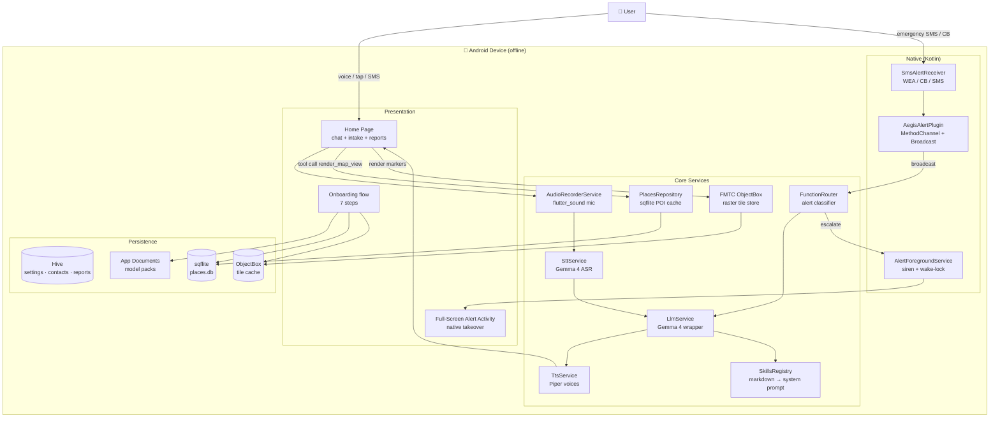
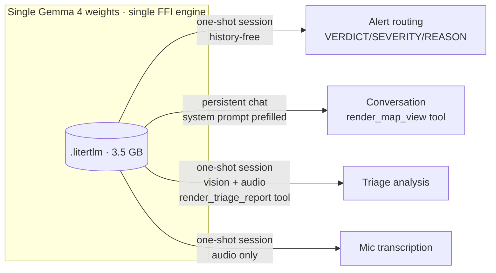
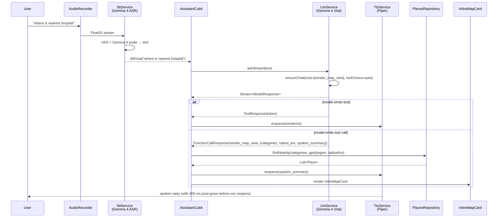
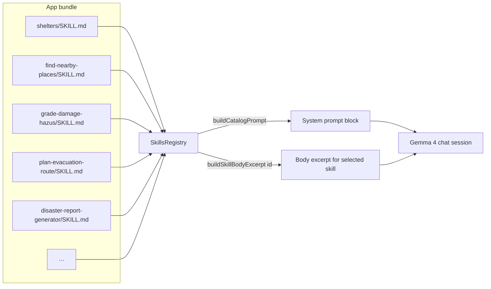
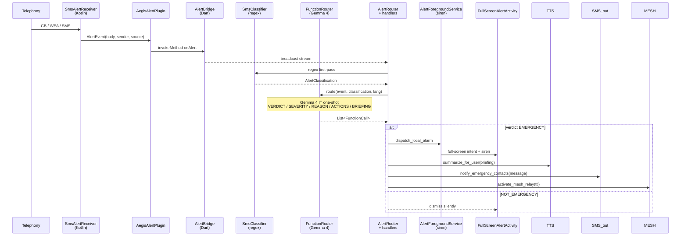
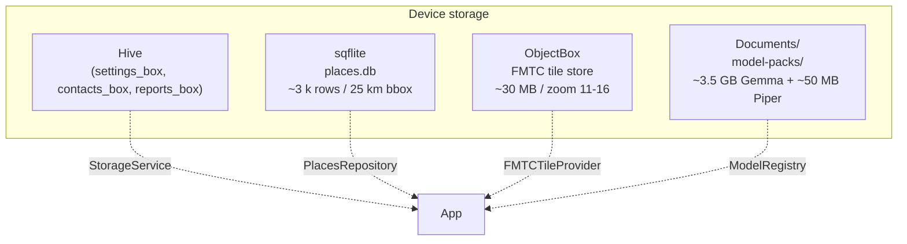
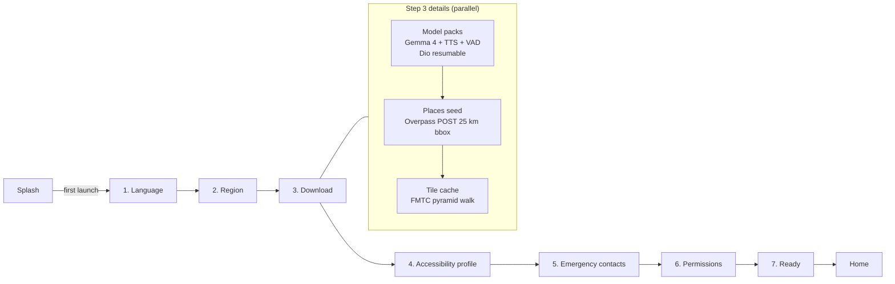
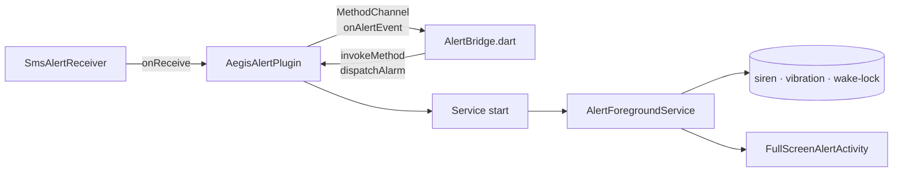
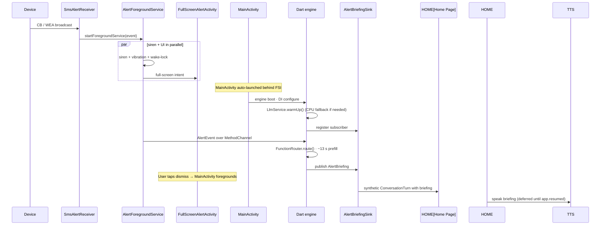

# Aegis — Technical Architecture

> **Aegis is an offline-first AI emergency assistant.** Every capability — voice transcription, chat reply, structured incident report, alert classification, nearby-places lookup, basemap rendering — runs on-device, with one shared Gemma 4 model handling the language tasks. No data leaves the device once the one-time model + region packs are downloaded.

This document is the single source of truth for how the app is composed end-to-end. It is generated against the live source tree (`vk/ac94-find-nearby-plac` branch) and is intended to live in the repo so external contributors can reason about the system without spelunking the codebase.

---

## 1. System Overview



---

## 2. Tech Stack

| Layer | Technology | Why |
|---|---|---|
| App framework | **Flutter** (Dart `^3.11.5`, SDK `^3.41.7`) | One codebase, native performance, mature plugin ecosystem |
| State management | **flutter_bloc / freezed** | Pure cubits keep reactive state immutable; freezed gives `copyWith` + value equality |
| DI | **get_it** | Composition-root pattern; lazy singletons for heavy engines |
| Routing | **go_router** | Declarative, deep-link safe, plays well with onboarding gating |
| LLM runtime | **flutter_gemma `^0.15.0`** → LiteRT-LM | Native `ModelType.gemma4` with `<tool_call>` token stream parsing |
| LLM model | **Gemma 4 E2B IT** (`.litertlm` bundle) | 2B-param instruction-tuned model with vision + audio multimodal heads |
| STT | Gemma 4 audio modality | Reuse single weights → fewer packs, lower disk |
| TTS | **sherpa_onnx** + Piper voices | On-device neural TTS, 12+ languages |
| VAD | sherpa_onnx + Silero VAD | Mic gating during conversation |
| Audio capture | **flutter_sound `^9.30`** | 16 kHz mono float32 stream to STT |
| Map | **flutter_map `^8.3`** + **flutter_map_tile_caching `^10.1`** | CARTO Voyager raster tiles cached in ObjectBox |
| POI DB | **sqflite `^2.4`** | Indexed bbox + category queries, <10 ms at 10 k rows |
| K-V store | **hive_ce** | Settings, contacts, reports |
| Networking (onboarding only) | **dio**, **http** | Resumable model-pack download, Overpass POST |
| Telephony / wake-app | **flutter_local_notifications**, **vibration**, **wakelock_plus**, **url_launcher** | Native siren + full-screen-intent takeover |
| i18n | **flutter_localizations**, **intl** | Arb-driven strings for EN + HI today |
| Codegen | **freezed**, **json_serializable**, **hive_ce_generator** | Immutability + Hive adapters |

---

## 3. Repository Layout

```
lib/
├── app/
│   ├── app.dart            # MaterialApp, locale, theme
│   ├── router.dart         # GoRouter, AppRoute enum
│   └── theme.dart          # AegisColors palette
├── core/
│   ├── alert/              # Alert pipeline (Dart side)
│   │   ├── alert_bridge.dart       # MethodChannel + broadcast stream
│   │   ├── alert_event.dart        # Event domain model (SMS/CB/WEA)
│   │   ├── alert_router.dart       # Dispatch table → handlers
│   │   ├── alert_handler.dart      # Side-effect handlers
│   │   └── alert_briefing_sink.dart# Pub/sub between handler ↔ chat surface
│   ├── di/injection.dart   # get_it composition root
│   ├── geo/                # Country / region resolver from lat/lng
│   ├── llm/
│   │   ├── function_call.dart      # FunctionRouteAction enum (alert tools)
│   │   └── function_router.dart    # Gemma-4-driven alert classifier
│   ├── places/             # find-nearby-places feature core
│   │   ├── place.dart                          # Domain model + category enum
│   │   ├── overpass_query.dart                 # OSM Overpass POST + bbox
│   │   ├── osm_place_mapper.dart               # OSM tags → PlaceCategory
│   │   ├── places_database.dart                # sqflite schema + queryNearby
│   │   ├── places_repository.dart              # Public read API
│   │   ├── onboarding_places_downloader.dart   # One-shot Overpass seeder
│   │   ├── tile_cache_downloader.dart          # FMTC tile-pyramid seeder
│   │   └── map_view_query.dart                 # MapViewQuery + ChatStreamEvent
│   ├── skills/             # Agent Skills registry
│   │   ├── skill.dart                          # Parsed SKILL.md
│   │   └── skills_registry.dart                # Frontmatter → system prompt
│   ├── sms_classifier/     # Regex first-pass classifier
│   ├── storage/            # Hive box wrapper
│   └── voice/              # LLM + audio engines
│       ├── llm_service.dart        # The brain — see §5
│       ├── stt_service.dart        # Gemma-4 ASR wrapper
│       ├── tts_service.dart        # sherpa_onnx Piper wrapper
│       ├── audio_recorder_service.dart
│       ├── model_catalog.dart      # Country → ModelPlan
│       ├── model_pack.dart         # VoiceModelPack
│       ├── model_registry.dart     # Installed packs index
│       ├── model_pack_repository.dart # Dio-backed download
│       ├── triage_input.dart       # generateReport input DTO
│       └── triage_report.dart      # generateReport output DTO
├── features/
│   ├── home/               # Chat + intake + assistant surface
│   ├── onboarding/         # 7-step funnel
│   ├── places/             # Inline map card + standalone page
│   ├── reports/            # Saved triage reports archive
│   └── splash/
├── models/                 # Cross-feature DTOs (AppRegion, EmergencyContact…)
├── l10n/                   # arb files
└── main.dart               # FMTC + FlutterGemma init, DI bootstrap

assets/skills/              # Agent Skills catalog — see §6
android/app/src/main/kotlin/com/resq/aegis/
├── MainActivity.kt
├── AegisApplication.kt
└── alert/
    ├── AegisAlertPlugin.kt          # MethodChannel handler
    ├── AlertForegroundService.kt    # Siren + wake-lock
    ├── FullScreenAlertActivity.kt   # Takeover screen
    ├── SmsAlertReceiver.kt          # Telephony broadcasts
    ├── BootReceiver.kt              # Re-arm after reboot
    ├── AlertEvent.kt                # Kotlin event model
    └── AlertConstants.kt
```

---

## 4. Gemma 4 — The Single Brain

Aegis uses **one** Gemma 4 E2B IT (`.litertlm`) model for every language task. This is deliberate: one set of weights → ~3.5 GB pack instead of N specialised models, and one warm engine in memory at any moment.

### 4.1 Capabilities Used

| Capability | Aegis surface | How |
|---|---|---|
| **Multilingual chat** | Home chat reply | `chat.generateChatResponseAsync()` text stream, language pinned via system prompt |
| **Vision** | Triage photo analysis | `Message(imageBytes: jpegBytes)` → encoded to 384px before send |
| **Audio (ASR)** | STT for mic capture | `Message(audioBytes: wav16k)` → text response |
| **Native function calling** | Triage tool + map tool | `tools: [Tool(name, description, parameters)]`, model emits `<\|tool_call\|>` tokens which LiteRT-LM parses into `FunctionCallResponse` |
| **Tool-choice modes** | `required` for triage, `auto` for chat | Forces structured output where needed, leaves chat free to reply in prose |
| **Multi-tool selection** | Skill catalog | All available `assets/skills/*/SKILL.md` frontmatter is concatenated into the system prompt so the model can pick a skill by id |

### 4.2 Two Roles, One Model



LiteRT-LM only allows one in-process engine; `LlmService` swaps `Conversation` configs on demand. The chat session is kept warm across user turns so the system prompt prefills only once per conversation (~13 s cold, ~2 s warm).

### 4.3 Tool Definitions

`lib/core/voice/llm_service.dart` declares two `Tool` objects.

| Tool | Purpose | ToolChoice | Path |
|---|---|---|---|
| `render_triage_report` | Structured ICS-209 / OCHA-SITREP report card | `required` | `generateReport(TriageInput)` — one-shot session, vision + audio + text |
| `render_map_view` | Inline map card with nearby POIs | `auto` | `askStream(text)` — persistent chat session, optional tool call |

Triage parameters mirror `TriageReport` fields 1:1 — `format`, `severity`, `hazard_type`, `immediate_actions[]`, `body`, `casualty_status`, `hazus_category` … Map parameters are tight: `categories[]` (enum of 12 POI types), `radius_km`, `spoken_summary`.

---

## 5. LLM Pipeline (Chat Turn)



**Key invariants**
- `Stream.listen` does **not** await async callbacks. Map-call resolution is awaited explicitly after the stream closes (`Future.wait(mapCallFutures)`), otherwise the listen loop would restart the mic before TTS plays, causing an echo loop.
- `_looksLikeToolCallJson()` strips the SDK's transitional `{"role":"assistant","tool_calls":[…]}` raw-JSON emission so it never reaches the chat bubble.
- `setBriefingContext()` appends a recent alert briefing to the next chat session's system prompt so follow-up questions ("what should I do?") have context without the user re-explaining.

---

## 6. Skills System



**Currently shipped skills** (`assets/skills/<id>/SKILL.md`):

| id | Triggers when… |
|---|---|
| `find-nearby-places` | User asks for shelter / hospital / water / fuel / etc. — Gemma fires `render_map_view` tool |
| `compose-briefing` | User asks "what's happening" — synthesise GPS + region pack into a briefing |
| `intake-survivor-statement` | Voice-only triage flow, START colour assignment |
| `grade-damage-hazus` | Photo + scene description → HAZUS 0-4 scale |
| `plan-evacuation-route` | "How do I get out" — routes from GPS to nearest shelter |
| `disaster-report-generator` | Long-form ICS-209 / OCHA-SITREP — fires `render_triage_report` tool |
| `match-mesh-beacon` | Cross-reference a report against local BLE mesh log |

Adding a new skill = drop a new `SKILL.md` under `assets/skills/<id>/`, register the path in `pubspec.yaml`, append the id to `SkillsRegistry._builtInSkillIds`. No Dart dispatch code required for the "should I invoke this?" decision — Gemma 4 reads the catalog and picks.

---

## 7. Alert Pipeline



`FunctionRouter` deliberately re-uses the chat brain (Gemma 4 IT) rather than the retired FunctionGemma 270M — the latter knew nothing about disaster terminology and escalated promo SMS as easily as real cyclone warnings. The strict `VERDICT:` / `SEVERITY:` envelope is parsed defensively (negative tokens win ties so "NOT_EMERGENCY" never collapses to "EMERGENCY").

---

## 8. Offline Storage Layers



| Store | Backed by | Schema | Lifecycle |
|---|---|---|---|
| `settings_box` | Hive | Onboarding flag, language, region, accessibility profile, hardware fallback sentinels | Persistent |
| `contacts_box` | Hive | EmergencyContact (≤5) | User-managed |
| `reports_box` | Hive | Confirmed TriageReport with attachments paths | Append-only |
| `places.db` | sqflite | `places(id, name, category, lat, lng, address, phone, features, status, last_verified)` + indices on `(lat,lng)`, `(category)`, `(status)` + `status_patches` table | Seeded at onboarding, re-runnable |
| FMTC tile store | ObjectBox | CARTO Voyager raster tiles | Seeded at onboarding (zoom 11-16), `cacheFirst` strategy at runtime |
| Model packs | Filesystem (`getApplicationDocumentsDirectory`) | `.litertlm`, `.onnx`, MBTiles, Piper bundles | Downloaded once via Dio with resumable chunked transfer, SHA-256 verified |

---

## 9. Onboarding Funnel



The download phase runs serially in the cubit because all three share network bandwidth, but each is independently fault-tolerant — if the Overpass POST fails the model pack still installs, and vice versa. The `ModelDownloadCubit` tracks per-phase progress on `placesProgressMessage` and `tilesProgressMessage` so the UI can surface granular status.

---

## 10. Native Android Bridge

The Flutter side is intentionally thin where the OS demands. Three subsystems live in Kotlin:

| Surface | Why native | Kotlin entry |
|---|---|---|
| Inbound emergency telephony | SMS / Cell Broadcast / WEA require BroadcastReceiver + permissions Flutter cannot register | `SmsAlertReceiver`, `AegisAlertPlugin` |
| Wake-the-screen siren | Full-screen-intent + foreground service + wake-lock + audio focus | `AlertForegroundService`, `FullScreenAlertActivity` |
| Cold-boot re-arm | `BOOT_COMPLETED` re-registers receivers after device restart | `BootReceiver` |



The MethodChannel is bidirectional: native pushes inbound alerts up, Dart pushes dispatch decisions down. The Dart-side `AlertBridge` exposes a broadcast `Stream<AlertEvent>` so multiple subscribers (the `AlertRouter`, the home UI, any future debug overlay) can listen independently.

---

## 11. Sequence: Cold-Start Emergency

The hardest path through the system. App is closed, device is locked, an emergency cell-broadcast arrives.



The deferred-TTS gate (`_isAppForeground`) is what stops the briefing speaking through the speaker while the siren is still going.

---

## 12. Build & Deploy Notes

```bash
# fvm is pinned because system Flutter 3.29 is too old
fvm flutter pub get
fvm dart run build_runner build --delete-conflicting-outputs
fvm flutter run -d <device>
```

- Android `minSdk` is whatever flutter_gemma + ObjectBox demand (≥ 24).
- Release builds: `fvm flutter build apk --obfuscate --split-debug-info=./debug-info/`.
- ProGuard / R8 already accommodate the LiteRT-LM JNI and ObjectBox generated code via package rules.
- The first launch downloads ~3.5 GB; subsequent launches are fully offline.

---

## 13. Where to Look for X

| Question | File |
|---|---|
| "How does the chat turn flow?" | `lib/features/home/cubit/assistant_cubit.dart::_runChat` |
| "How is Gemma 4 invoked?" | `lib/core/voice/llm_service.dart::askStream`, `generateReport` |
| "How do tools get exposed?" | `lib/core/voice/llm_service.dart` — `_renderTriageReportTool`, `_renderMapViewTool` |
| "How is an alert classified?" | `lib/core/llm/function_router.dart::route` |
| "How does a place search work?" | `lib/core/places/places_database.dart::queryNearby` |
| "How does the offline tile cache load?" | `lib/features/places/widgets/inline_map_card.dart` (FMTCTileProvider) |
| "Where do skills live?" | `assets/skills/<id>/SKILL.md` |
| "How does the system prompt get built?" | `lib/core/skills/skills_registry.dart::buildCatalogPrompt` |
| "How does onboarding seed offline data?" | `lib/features/onboarding/download/cubit/model_download_cubit.dart` |
| "How does an SMS reach Dart?" | `android/.../alert/SmsAlertReceiver.kt` → `AegisAlertPlugin.kt` → `lib/core/alert/alert_bridge.dart` |

---

## 14. Design Principles

1. **Offline is the default, not the fallback.** The only network calls live in onboarding (model + POI + tile seed).
2. **One model, many capabilities.** Gemma 4's vision + audio + text + tool calling collapse what would be 4 separate engines into one warm session.
3. **Markdown over Dart for capability declarations.** Skills are `.md` files so partner orgs (WHO, IFRC, ICRC) can ship them without a Flutter build.
4. **Native only where the OS demands it.** Telephony, full-screen intent, wake-lock. Everything else stays in Dart.
5. **Defensive parsing of model output.** Gemma 4 occasionally emits `<|"|>` escape pairs, raw-text tool envelopes, or degenerate `render_report()` tails — the parsers strip all of it. Hallucinations must never silence a siren or invent a place name.
6. **Echo-safe conversation loop.** TTS playback is drained before mic reopens; 400 ms post-grace absorbs speaker decay. No infinite tool-call loops.

---

## License & Attribution

- Map tiles: © OpenStreetMap contributors, © CARTO (Voyager basemap)
- POI data: © OpenStreetMap contributors via Overpass API
- LLM: Gemma 4 E2B IT under the Gemma Terms of Use
- TTS voices: Piper (MIT) + sherpa-onnx
- Source-tree license: see `LICENSE` at the repo root
